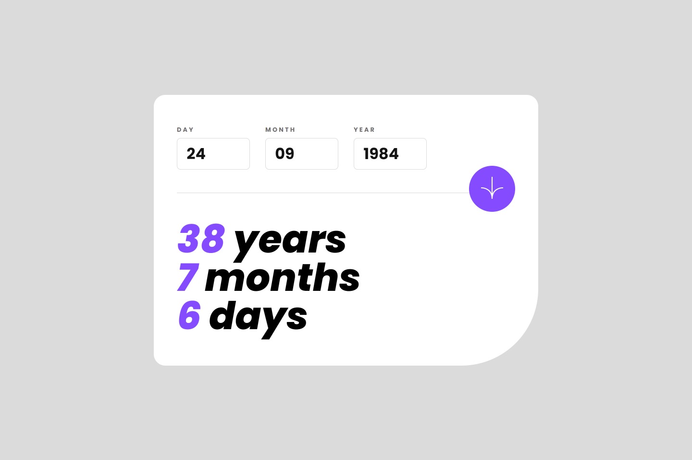
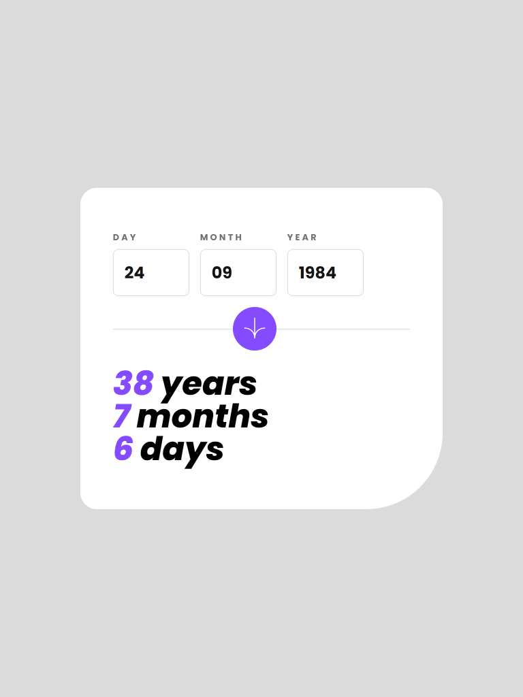
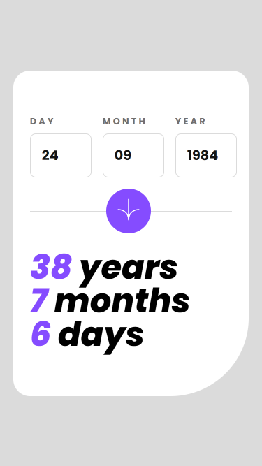

# Age-Calculator-App

This a responsive calculator app that accepts your date of birth and returns your current age in years, months and days. The design was gotten from [Frontend Mentor](https://www.frontendmentor.io/)

## Table of contents

-   [Age-Calculator-App](#age-calculator-app)
    -   [Table of contents](#table-of-contents)
    -   [Overview](#overview)
        -   [The challenge](#the-challenge)
        -   [Screenshot](#screenshot)
        -   [Links](#links)
    -   [My process](#my-process)
        -   [Built with](#built-with)
        -   [Features](#features)
        -   [What I learned](#what-i-learned)
    -   [Author](#author)

## Overview

### The challenge

Users should be able to:

-   View an age in years, months, and days after submitting a valid date through the form
-   Receive validation errors if:
    -   Any field is empty when the form is submitted
    -   The day number is not between 1-31
    -   The month number is not between 1-12
    -   The year is in the future
    -   The date is invalid e.g. 31/04/1991 (there are 30 days in April)
-   View the optimal layout for the interface depending on their device's screen size
-   See hover and focus states for all interactive elements on the page
-   See the age numbers animate to their final number when the form is submitted

### Screenshot

1. Dektop View
   

2. Tablet View
   

3. Mobile View
   

### Links

-   Solution URL: [Source code](https://github.com/ChinatuL/Age-Calculator-App)
-   Live Site URL: [Live Site](https://age-calculator-app-chinatul.vercel.app/)

## My process

### Built with

-   HTML
-   CSS
-   SCSS
-   Vanilla JavaScript
-   [dayjs](https://day.js.org/)

### Features

-   Web Accessibility
-   Form validation
-   Animated calculator result

### What I learned

Working with dates can be very tricky so I had to learn to use a JavaScript library called [dayjs](https://day.js.org/) for calculating the difference in years, months and days.

The most challenging part of this project was calculating the difference in days because of the irregularities in the length of days in each month.

I had to use a conditional calculating the day if the month entered was the same as the current month. This is the solution I came up with.

```js
let dayDifference = 0;
if (day <= now.date()) {
    dayDifference = now.date() - day;
} else {
    dayDifference = now.daysInMonth() + now.date() - day;
}
```

## Author

-   Frontend Mentor - [@ChinatuL](https://www.frontendmentor.io/profile/ChinatuL)
-   Twitter - [@ChinatuLucia](https://www.twitter.com/chinatulucia)
